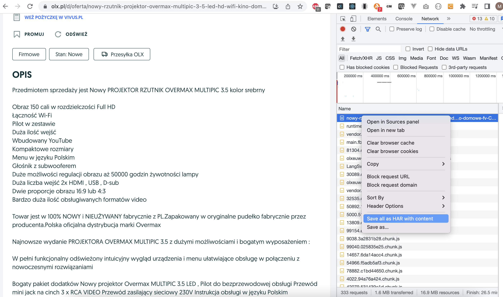

# Pobieranie numer telefonu z ogłoszenia na OLX.pl 

1. Zainstaluj niezbędne biblioteki komendą ``pip install -r requirements.txt``
2. Otwórzy żądaną stronę na <a href='https://olx.pl/' target=_blank>OLX.pl</a> i zaloguj się
3. Otwórz w przeglądarce Developer Tools (F12)
4. Wybierz na zakładce "*Network*" żądanie pobrania strony z pkt1.
5. Kliknij prawym klawiszem myszki i zapisz wszystkie żądania w formacie HAR - https://en.wikipedia.org/wiki/HAR_(file_format)

6. Zapisany plik podaj jako parametr do wywołania skryptu <a href='olx-get-phone.py'>olx-get-phone.py</a> - ``python3 olx-get-phone.py www.olx.pl.har``
